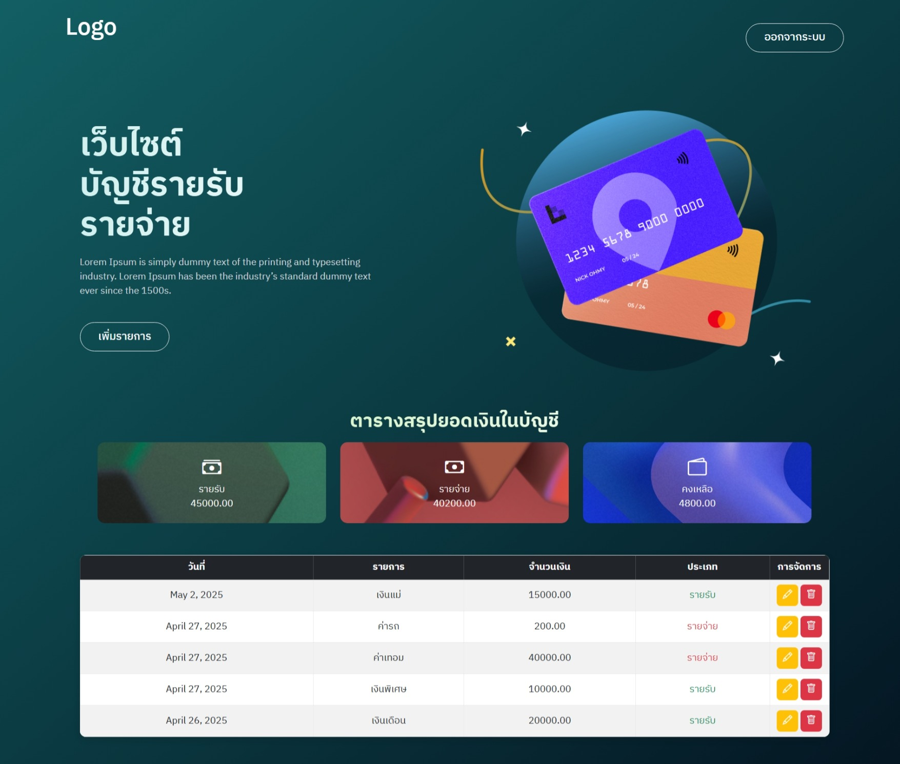
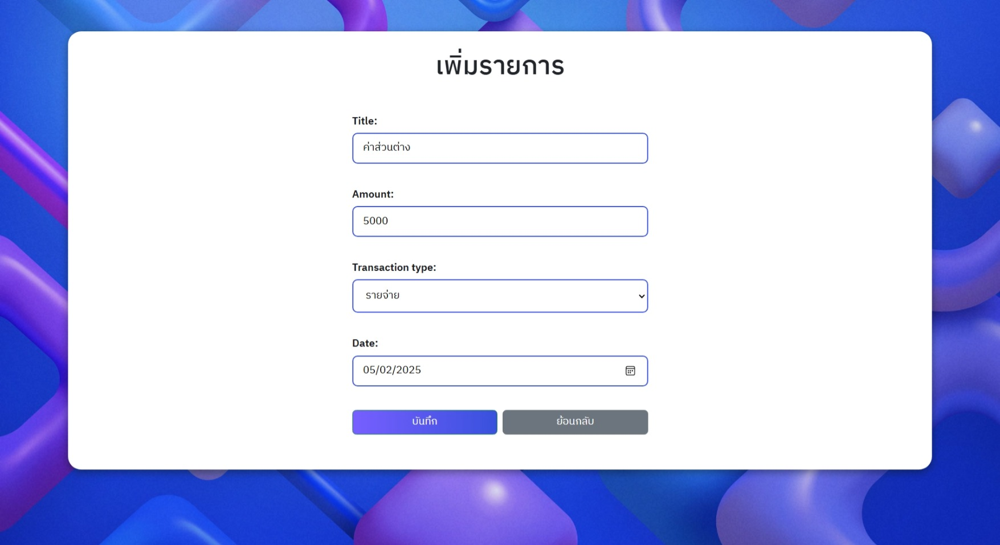

# เว็บบันทึกค่าใช้จ่ายด้วย Django

## รายละเอียดโปรเจกต์
ระบบนี้พัฒนาโดยใช้ Django สำหรับบันทึกรายรับค่ารายประจำวัน
## 💡 ฟีเจอร์หลัก
- ระบบlogin logout
- เพิ่มรายการรายรับ / รายจ่าย ข้อมูลวันที่ จำนวนเงิน และประเภท
- แสดงข้อมูลในตาราง
- สรุปยอด รายรับ, รายจ่าย, และ คงเหลือ แบบอัตโนมัติ
- ปุ่มลบและแก้ไขในแถวตาราง สามารถลบ หรือ แก้ไขรายการในตารางได้

## 📦 Google Drive รวมรูปและคลิป
- [📁 รวมรูป + คลิปทั้งหมด](https://drive.google.com/drive/folders/1MMcC0G0OIjId3a1klzyQV8Z5vx28GQ3y?usp=drive_link)
- [📸 Screenshot Folder](https://drive.google.com/drive/folders/1Usn6USFq9jyNT5buKIbrd0qpelniAk4e?usp=drive_link)
- [🖼️ Infographic](https://drive.google.com/drive/folders/1C6t-PHXEYhsv8SoJeBQw7nZX6fpEwZZa?usp=drive_link)
- [🎥 คลิปวิดีโออธิบายเว็บไซต์](https://drive.google.com/drive/folders/1Ri2z1tE7lVasHYUrQn1L4_nE5OyjWzr2?usp=drive_link)

## 📸 Screenshot

## Infographic

## 📹 VDO
[google drive VDO](https://drive.google.com/drive/folders/1Ri2z1tE7lVasHYUrQn1L4_nE5OyjWzr2?usp=drive_link)
